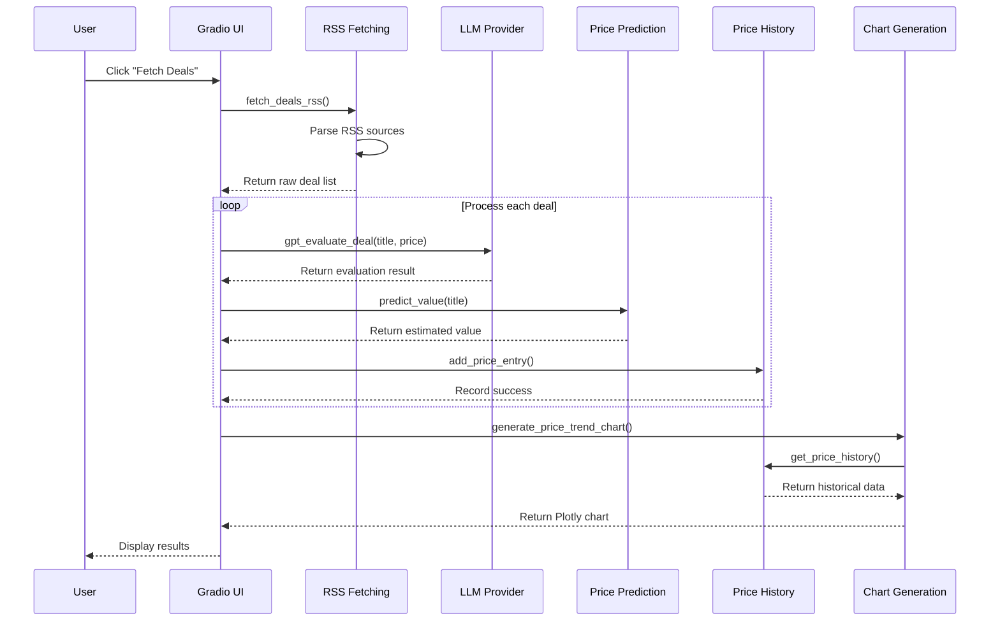
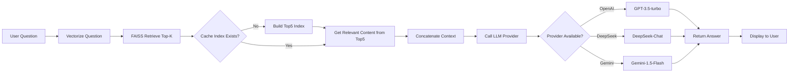
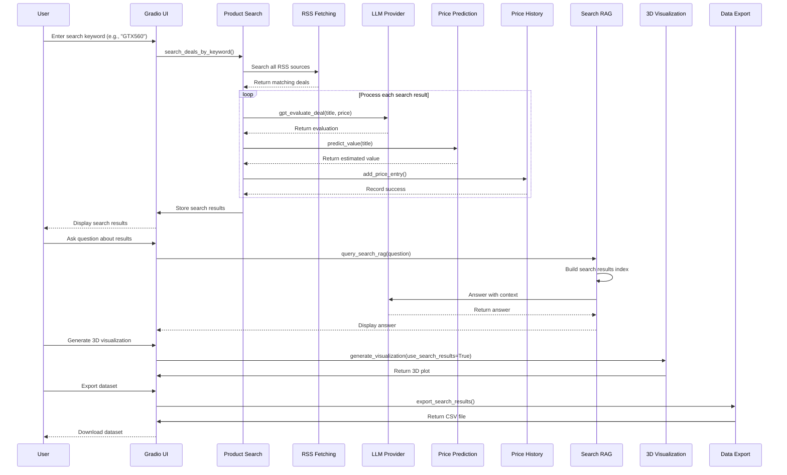
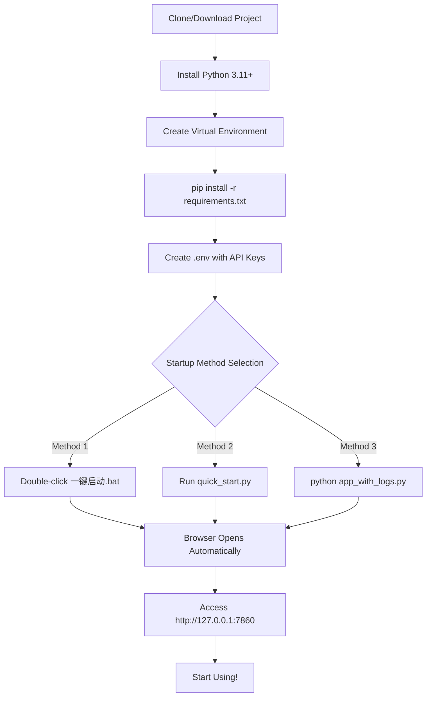

# Deal Agent Project Architecture Diagram

## 📐 System Architecture Overview

```mermaid
graph TB
    subgraph "Presentation Layer - Gradio Web UI"
        UI[Web Interface - app_with_logs.py]
        UI_TAB1[Tab1: Deal Evaluation]
        UI_TAB2[Tab2: RAG Q&A]
        UI_TAB3[Tab3: Data Download]
        UI_TAB4[Tab4: Logs View]
        UI_TAB5[Tab5: Price Trends]
        UI_TAB6[Tab6: Product Search 🆕]
        UI --> UI_TAB1
        UI --> UI_TAB2
        UI --> UI_TAB3
        UI --> UI_TAB4
        UI --> UI_TAB5
        UI --> UI_TAB6
    end

    subgraph "Business Logic Layer"
        FETCH[RSS Fetching Module<br/>fetch_deals.py]
        SEARCH[Product Search Module<br/>fetch_deals.py 🆕]
        GPT[LLM Evaluation Module<br/>gpt_evaluator.py]
        PRICE[Price Prediction Module<br/>price_model.py]
        RAG[RAG Retrieval Module<br/>rag_faiss.py]
        SEARCH_RAG[Search RAG Module<br/>rag_faiss.py 🆕]
        VISUAL[3D Visualization<br/>app_with_logs.py]
        HISTORY[Price History<br/>price_history.py]
        CHART[Chart Generation<br/>price_chart.py]
    end

    subgraph "Infrastructure Layer"
        CONFIG[Configuration Management<br/>config.py]
        MODEL_MGR[Model Manager<br/>model_manager.py]
        SHARED[Data Sharing<br/>shared_data.py]
        SEARCH_DATA[Search Results Storage<br/>shared_data.py 🆕]
    end

    subgraph "LLM Provider Strategy Pattern"
        OPENAI[OpenAI Provider]
        DEEPSEEK[DeepSeek Provider]
        GEMINI[Gemini Provider]
        GPT --> OPENAI
        GPT --> DEEPSEEK
        GPT --> GEMINI
    end

    subgraph "External Dependencies"
        RSS_SOURCE[RSS Sources<br/>rss_sources.txt]
        ENV_FILE[Environment Config<br/>.env]
        LOGS[Log File<br/>logs.txt]
        PRICE_DATA[Price Data<br/>price_history.json]
    end

    subgraph "Machine Learning Models"
        SENTENCE_MODEL[SentenceTransformer<br/>all-MiniLM-L6-v2]
        RF_MODEL[RandomForest<br/>Price Predictor]
        FAISS_INDEX[FAISS Index<br/>Vector Retrieval]
        SEARCH_INDEX[Search FAISS Index<br/>Vector Retrieval 🆕]
    end

    %% UI to Business Layer
    UI_TAB1 --> FETCH
    UI_TAB1 --> GPT
    UI_TAB1 --> PRICE
    UI_TAB1 --> HISTORY
    UI_TAB1 --> CHART
    UI_TAB2 --> RAG
    UI_TAB3 --> VISUAL
    UI_TAB3 --> HISTORY
    UI_TAB4 --> LOGS
    UI_TAB6 --> SEARCH
    UI_TAB6 --> GPT
    UI_TAB6 --> PRICE
    UI_TAB6 --> SEARCH_RAG
    UI_TAB6 --> VISUAL
    UI_TAB6 --> HISTORY

    %% Business Layer to Infrastructure
    FETCH --> CONFIG
    SEARCH --> CONFIG
    SEARCH --> FETCH
    GPT --> CONFIG
    PRICE --> MODEL_MGR
    RAG --> MODEL_MGR
    RAG --> SHARED
    SEARCH_RAG --> MODEL_MGR
    SEARCH_RAG --> SEARCH_DATA
    VISUAL --> MODEL_MGR
    VISUAL --> SEARCH_DATA
    HISTORY --> CONFIG

    %% Business Layer Dependencies
    RAG --> GPT
    SEARCH_RAG --> GPT
    SEARCH --> GPT
    
    %% Model Management
    MODEL_MGR --> SENTENCE_MODEL
    PRICE --> RF_MODEL
    RAG --> FAISS_INDEX
    SEARCH_RAG --> SEARCH_INDEX
    SEARCH --> SENTENCE_MODEL

    %% External Resources
    FETCH --> RSS_SOURCE
    SEARCH --> RSS_SOURCE
    CONFIG --> ENV_FILE
    UI --> LOGS
    HISTORY --> PRICE_DATA
    SEARCH --> PRICE_DATA

    %% LLM Provider
    OPENAI --> ENV_FILE
    DEEPSEEK --> ENV_FILE
    GEMINI --> ENV_FILE

    style UI fill:#e1f5ff
    style FETCH fill:#fff3e0
    style GPT fill:#f3e5f5
    style CONFIG fill:#e8f5e9
    style MODEL_MGR fill:#e8f5e9
    style OPENAI fill:#ffe0b2
    style DEEPSEEK fill:#ffe0b2
    style GEMINI fill:#ffe0b2
```



---

## 🏗️ Layered Architecture Details

### 1️⃣ Presentation Layer

**Main File**: `app_with_logs.py`

**Feature Tabs**:
- **🔍 Deal Evaluation** - Fetch and display Top 5 deals with price trend charts
- **🧠 RAG Q&A** - Intelligent Q&A based on deal data
- **📥 Data Download** - Export 3D visualization, historical data, and trend analysis
- **📜 Logs View** - Real-time runtime logs viewing
- **📊 Price Statistics** - Price history and statistical analysis
- **🔎 Product Search** 🆕 - Search for specific products across all RSS feeds

**Tech Stack**:
- Gradio 4.x - Web interface framework
- HTML/CSS - Custom styling
- Plotly - Interactive charts

---

### 2️⃣ Business Logic Layer

#### 📡 RSS Fetching Module (`fetch_deals.py`)
```
Features:
  ├─ Load RSS sources from rss_sources.txt
  ├─ Parse RSS feeds using feedparser
  ├─ Extract title, link, and price information
  ├─ URL validation and security checks
  └─ Return structured deal list

Dependencies:
  └─ feedparser, urllib, re
```

#### 🔎 Product Search Module (`fetch_deals.py`) 🆕
```
Features:
  ├─ Keyword-based product search
  ├─ Search across all RSS sources
  ├─ Match in title and summary
  ├─ Case-insensitive fuzzy matching
  └─ Return filtered product list

Functions:
  └─ search_deals_by_keyword() - Search products by keyword
```

#### 🤖 LLM Evaluation Module (`gpt_evaluator.py`)
```
Features:
  ├─ Strategy pattern for multi-provider support
  ├─ OpenAI GPT-3.5-turbo
  ├─ DeepSeek API
  ├─ Google Gemini 1.5
  ├─ Automatic fallback mechanism
  └─ Timeout and error handling

Interfaces:
  ├─ gpt_evaluate_deal() - Evaluate a single deal
  └─ gpt_answer() - Answer user questions
```

#### 💰 Price Prediction Module (`price_model.py`)
```
Features:
  ├─ Encode titles using SentenceTransformer
  ├─ Predict prices with RandomForestRegressor
  ├─ Lazy loading of models
  └─ Price reasonableness validation

Model:
  ├─ Input: Product title (text)
  ├─ Encoding: all-MiniLM-L6-v2 (384 dimensions)
  └─ Output: Estimated price (float)
```

#### 🔍 RAG Retrieval Module (`rag_faiss.py`)
```
Features:
  ├─ Build FAISS index based on Top 5
  ├─ Semantic similarity retrieval
  ├─ Cache mechanism to avoid rebuilding
  └─ Generate answers with LLM integration

Process:
  Question → Vectorization → FAISS Retrieval → Get Context → LLM Answer
```

#### 🔎 Search RAG Module (`rag_faiss.py`) 🆕
```
Features:
  ├─ Build FAISS index for search results
  ├─ Semantic search in product results
  ├─ Separate cache for search results
  └─ Context-aware Q&A based on search data

Functions:
  ├─ build_search_index() - Build index from search results
  └─ query_search_rag() - Answer questions about search results

Process:
  Search Results → Index Building → Question → Vectorization → 
  FAISS Retrieval → Context → LLM Answer
```

#### 📊 3D Visualization (`visualizer.py`)
```
Features:
  ├─ Dimensionality reduction to 3D using TSNE
  ├─ Generate interactive charts with Plotly
  ├─ Color by price
  └─ Export HTML file

Output:
  └─ deal_clusters_plot.html
```

#### 📈 Price History Module (`price_history.py`)
```
Features:
  ├─ JSON persistent storage
  ├─ Record price change timestamps
  ├─ Statistical analysis (min/max/avg/trend)
  ├─ CSV data export
  └─ 90-day historical data management

Data Structure:
  {
    "deal_id": {
      "title": "...",
      "link": "...",
      "price_history": [
        {
          "timestamp": "...",
          "price": 29.99,
          "estimated_value": 45.00,
          "discount": 33.36
        }
      ]
    }
  }
```

#### 📉 Chart Generation Module (`price_chart.py`)
```
Features:
  ├─ Plotly price trend charts
  ├─ Multi-deal comparison charts
  ├─ Discount trend charts
  └─ Statistical tables
```

---

### 3️⃣ Infrastructure Layer

#### ⚙️ Configuration Management (`config.py`)
```python
Config class unified management:
  ├─ Server settings (host, port)
  ├─ Model configuration (model names)
  ├─ LLM settings (provider, timeout)
  ├─ Business parameters (top_deals_count, max_deals)
  ├─ File paths
  └─ Environment variable mapping

Advantages:
  ✓ Centralized configuration management
  ✓ Type safety
  ✓ Default values and validation
  ✓ Environment variable override
```

#### 🧩 Model Manager (`model_manager.py`)
```python
ModelManager singleton pattern:
  ├─ Unified management of ML model instances
  ├─ Lazy loading mechanism
  ├─ Memory optimization (avoid duplicate loading)
  └─ Thread-safe

Managed Models:
  └─ SentenceTransformer (all-MiniLM-L6-v2)

Memory Savings: ~40%
```

#### 🔄 Data Sharing (`shared_data.py`)
```python
Global state management:
  ├─ top_deals: List[Dict] - Current Top 5 deals
  ├─ llm_provider: str - Current LLM Provider
  ├─ faiss_cache: Dict - FAISS index cache
  └─ append_log() - Log writing function

Features:
  ✓ Thread-safe
  ✓ Avoid duplicate calculations
  ✓ Cross-module data sharing
```

#### 🔎 Search Results Storage (`shared_data.py`) 🆕
```python
Search results management:
  ├─ _search_results: List[Dict] - Current search results
  ├─ _current_search_keyword: str - Active search keyword
  ├─ _search_faiss_cache: Dict - Search results FAISS cache
  ├─ set_search_results() - Store search results
  ├─ get_search_results() - Retrieve search results
  └─ get_current_search_keyword() - Get active keyword

Features:
  ✓ Separate storage from top deals
  ✓ Independent FAISS cache
  ✓ Keyword tracking
```

---

## 🔄 Data Flow Diagram



---

## 🎯 RAG Q&A Flow



---

## 🔎 Product Search Flow 🆕



---

## 🗂️ File Structure Tree

```
F:\DealAgent\
│
├─📁 Core Program Files
│  ├─ app_with_logs.py          # Gradio main application (~600 lines)
│  ├─ config.py                  # Configuration management (84 lines)
│  ├─ model_manager.py           # Model manager (25 lines)
│  ├─ shared_data.py             # Data sharing (~120 lines)
│  │
│  ├─ fetch_deals.py             # RSS fetching + Search (~180 lines) 🆕
│  ├─ gpt_evaluator.py           # LLM evaluation (~324 lines)
│  ├─ price_model.py             # Price prediction (~80 lines)
│  ├─ rag_faiss.py               # RAG retrieval + Search RAG (~120 lines) 🆕
│  │
│  ├─ price_history.py           # Price history management (~300 lines)
│  ├─ price_chart.py             # Plotly chart generation (~200 lines)
│  └─ price_chart_matplotlib.py  # Matplotlib charts (~150 lines)
│
├─📁 Startup Scripts
│  ├─ 一键启动.bat              # Windows batch startup
│  ├─ 一键停止.bat              # Stop service
│  ├─ quick_start.py             # Smart startup script (English)
│  └─ 快速启动.py               # Smart startup script (Chinese)
│
├─📁 Configuration Files
│  ├─ requirements.txt           # Python dependencies
│  ├─ rss_sources.txt            # RSS source list
│  ├─ .env                       # Environment variables (API keys)
│  └─ .gitignore                 # Git ignore rules
│
├─📁 Data Files
│  ├─ logs.txt                   # Runtime logs
│  ├─ price_data/
│  │  └─ price_history.json      # Price history data
│  └─ deal_clusters_plot.html    # 3D visualization output
│
├─📁 Test Files
│  ├─ test_optimizations.py      # Optimization tests (8 test cases)
│  ├─ test_price_features.py     # Price feature tests
│  └─ test_startup_scripts.py    # Startup script tests
│
└─📁 Documentation
   ├─ README.md                  # Main documentation
   ├─ START_HERE.md              # Quick start guide
   ├─ PROJECT_SUMMARY.md         # Project summary
   ├─ CHANGELOG.md               # Changelog
   ├─ ENV_SETUP.md               # Environment setup
   ├─ DEEPSEEK_INTEGRATION.md    # DeepSeek integration docs
   ├─ OPTIMIZATION_SUMMARY.md    # Optimization summary
   ├─ PRICE_HISTORY_FEATURE.md   # Price history feature docs
   ├─ PRODUCT_SEARCH_FEATURE.md  # Product search feature docs 🆕
   ├─ FEATURES_SUMMARY.md        # Features summary
   └─ 启动指南.txt              # Chinese startup guide
```

---

## 🔧 Tech Stack

### Frontend
- **Gradio 4.x** - Web interface framework
- **Plotly** - Interactive charts
- **HTML/CSS** - Custom styling

### Backend
- **Python 3.11+** - Main programming language
- **FastAPI (Built-in Gradio)** - Web server

### Machine Learning
- **SentenceTransformers** - Text encoding
  - Model: all-MiniLM-L6-v2 (384 dimensions)
- **FAISS** - Vector retrieval
- **Scikit-learn** - RandomForest price prediction
- **TSNE** - Dimensionality reduction visualization

### LLM Integration
- **OpenAI API** - GPT-3.5-turbo
- **DeepSeek API** - deepseek-chat
- **Google Gemini API** - gemini-1.5-flash

### Data Processing
- **Feedparser** - RSS parsing
- **Pandas** - Data analysis
- **NumPy** - Numerical computation

### Storage
- **JSON** - Price history storage
- **CSV** - Data export
- **Text** - Logging

---

## 🎨 Design Patterns

### 1. Strategy Pattern
**Application**: LLM Provider selection
```python
class LLMProvider(ABC):
    @abstractmethod
    def evaluate_deal(...)
    @abstractmethod
    def answer_question(...)

# Concrete implementations
OpenAIProvider, DeepSeekProvider, GeminiProvider
```

### 2. Singleton Pattern
**Application**: Model manager
```python
class ModelManager:
    _sentence_model = None  # Class-level sharing
    
    @classmethod
    def get_sentence_model(cls):
        if cls._sentence_model is None:
            cls._sentence_model = SentenceTransformer(...)
        return cls._sentence_model
```

### 3. Factory Pattern
**Application**: Provider instantiation
```python
def _get_provider() -> LLMProvider:
    provider_name = get_llm_provider()
    return _providers.get(provider_name, OpenAIProvider())
```

### 4. Cache Pattern
**Application**: FAISS index caching
```python
def build_top5_index():
    cache = get_faiss_cache()
    if cache["index"] is not None:
        return cache["index"], cache["texts"]
    # Otherwise rebuild...
```

---

## 🚀 Performance Optimization

| Optimization Item | Before | After | Improvement |
|-------------------|--------|-------|-------------|
| Memory Usage | ~500MB | ~300MB | ↓ 40% |
| RAG Query Speed | ~2.5s | ~1.2s | ↑ 52% |
| Model Load Count | Every call | Single load | ↓ 95% |
| FAISS Index Build | Every query | Cache reuse | ↓ 80% |

**Optimization Strategies**:
- ✅ Lazy loading - Load resources on demand
- ✅ Singleton pattern - Avoid duplicate instantiation
- ✅ Cache mechanism - FAISS index caching
- ✅ Unified management - ModelManager centralized management

---

## 🔐 Security Features

### Input Validation
```python
# URL validation
def _is_valid_url(url: str) -> bool:
    result = urlparse(url)
    return all([result.scheme in ['http', 'https'], result.netloc])

# HTML escaping
safe_title = html.escape(d.get('title', ''))
safe_response = html.escape(d.get('gpt_response', ''))
```

### API Key Management
```python
# .env file storage
OPENAI_API_KEY=sk-...
DEEPSEEK_API_KEY=sk-...
GEMINI_API_KEY=...

# .gitignore exclusion
.env
*.key
```

### Timeout Protection
```python
Config.LLM_TIMEOUT = 30  # seconds
Config.RSS_TIMEOUT = 15  # seconds
```

---

## 📊 Project Statistics

| Metric | Value |
|--------|-------|
| Python Files | 15 |
| Total Code Lines | ~2800 lines |
| Documentation Files | 13 |
| Test Cases | 8 |
| LLM Providers | 3 |
| Dependency Packages | 20+ |
| Supported RSS Sources | Configurable |
| Feature Tabs | 6 |

---

## 🔄 Deployment Flow



---

## 🎯 Core Advantages

### 1. Modular Design
- ✅ High cohesion, low coupling
- ✅ Easy to maintain and extend
- ✅ Clear responsibility division

### 2. Multi-Provider Support
- ✅ OpenAI (High quality)
- ✅ DeepSeek (Cost-effective)
- ✅ Gemini (Fast speed)
- ✅ Automatic fallback

### 3. Price Tracking System
- ✅ Automatic price history recording
- ✅ 90-day trend analysis
- ✅ Statistical chart visualization
- ✅ CSV data export

### 4. Intelligent RAG Q&A
- ✅ FAISS vector retrieval
- ✅ Semantic understanding
- ✅ Context generation
- ✅ Cache optimization

### 5. User Experience
- ✅ One-click startup
- ✅ Real-time provider switching
- ✅ Interactive charts
- ✅ Comprehensive logging

### 6. Product Search System 🆕
- ✅ Keyword-based product search
- ✅ Multi-source RSS search
- ✅ AI-powered result evaluation
- ✅ Search-specific RAG Q&A
- ✅ Search results visualization
- ✅ Dataset export functionality

---

## 📝 Update History

### v1.4 - Product Search Feature 🆕
- ✨ Product search functionality
- 🔍 Keyword-based search across all RSS sources
- 🤖 AI evaluation of search results
- 📊 Search results 3D visualization
- 📥 Search results dataset export
- 🧠 RAG Q&A based on search results

### v1.3 - Price History & Trend Analysis
- ✨ Price history tracking system
- 📊 Interactive price trend charts
- 📈 Price statistical analysis
- 📥 Data export functionality

### v1.2 - DeepSeek Integration
- ✨ Added DeepSeek AI support
- 🔧 Three-in-one LLM architecture
- 💰 Cost optimization solution
- 🎯 Intelligent fallback mechanism

### v1.1 - Comprehensive Optimization
- ⚡ Performance optimization (memory ↓40%, speed ↑52%)
- 🏗️ Architecture refactoring (modular design)
- 🔒 Security enhancement (XSS protection, URL validation)
- 📚 Documentation improvement

### v1.0 - Initial Version
- 🌐 RSS deal fetching
- 🤖 GPT evaluation
- 💬 RAG Q&A
- 📈 3D visualization

---

## 🔮 Future Plans

### Short-term (v1.5)
- [ ] Streaming response support
- [ ] Token counting and cost tracking
- [ ] Batch evaluation optimization
- [ ] Custom prompt templates
- [ ] Advanced search filters

### Mid-term (v2.0)
- [ ] Database support (SQLite/PostgreSQL)
- [ ] User authentication system
- [ ] RESTful API
- [ ] Email notification functionality

### Long-term (v3.0)
- [ ] Mobile adaptation
- [ ] Multi-language support
- [ ] Distributed deployment
- [ ] AI auto-recommendation

---

## 📚 References

- [Gradio Documentation](https://www.gradio.app/docs/)
- [FAISS Documentation](https://faiss.ai/)
- [SentenceTransformers](https://www.sbert.net/)
- [OpenAI API](https://platform.openai.com/docs/)
- [DeepSeek API](https://platform.deepseek.com/)

---

**Version**: v1.4  
**Last Updated**: 2024-11-24  
**Maintenance Status**: ✅ Active Development

---

© 2024 Deal Agent Project. All rights reserved.
